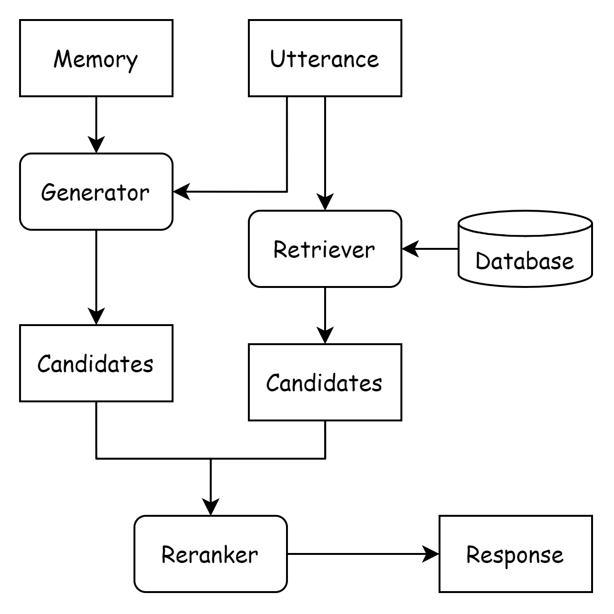

# Chatbot

## 1. Introduction

A hybrid retrieval-generation chatbot. 

<p align="center"></img></p>

## 2. How to use the code

### 2.1 Prepare data and build index

```bash
# download datasets
cd data
sh download.sh
gunzip lccc_large.jsonl.gz
cd ..

# prepare single turn dialog dataset
python data/prepare_data.py

# build inverted index for query
mkdir -p data/queries
sh indexing/build_query_index.sh

# build a sql table which allow us to select response given query's id
python indexing/build_response_table.py
```

The built index is under `./index` folder. 

### 2.2 Run the project

After finished above preparations, you can run the project directly:

```bash
python app.py --do_retrieval --do_generate
```

Note that the code will automatically download the pretrain models' checkpoints. If you want to donwload them manually, you can get more information from the model's huggingface page: [CDial-GPT_LCCC-large](https://huggingface.co/thu-coai/CDial-GPT_LCCC-large) and [sbert-chinese-nli](https://huggingface.co/uer/sbert-base-chinese-nli). Don't forget to modify the code to use right path.

For using only retrieval module or generating module, you can run:

```bash
# only retrieval
python app.py --do_retrieval
# or only generating
python app.py --do_generate
```

Refer to the code for more about arguments.

